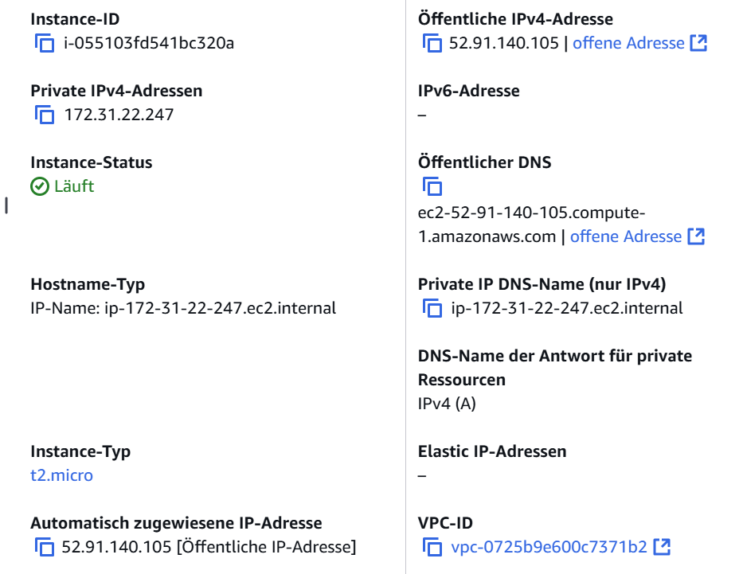
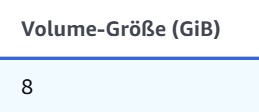
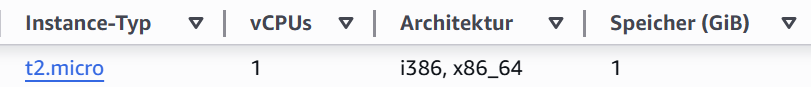
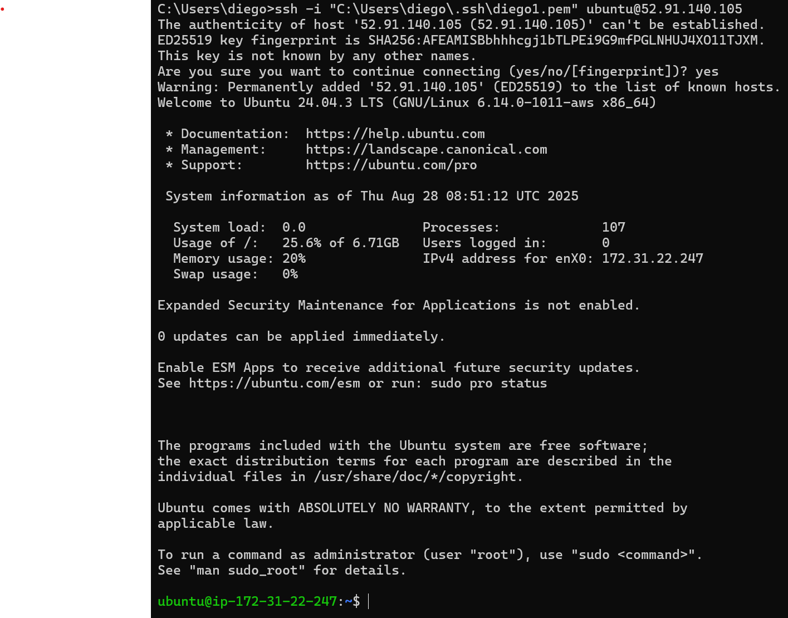
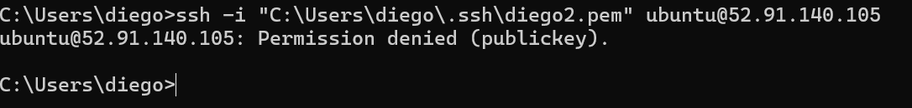
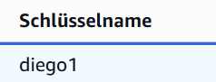

# KN02: IaaS - Virtuelle Server

### Instanz erstellen



### Einstellungen

#### Diskgrösse: 8GiB

#### RAM-Grösse: 1GiB, Anzahl CPUs:1



### Zugriff mit SSH-Key

```ps
ssh -i "C:\Users\diego\.ssh\diego1.pem" ubuntu@52.91.140.105
```


```ps
ssh -i "C:\Users\diego\.ssh\diego2.pem" ubuntu@52.91.140.105
```



Verwendeter Schlüssel


